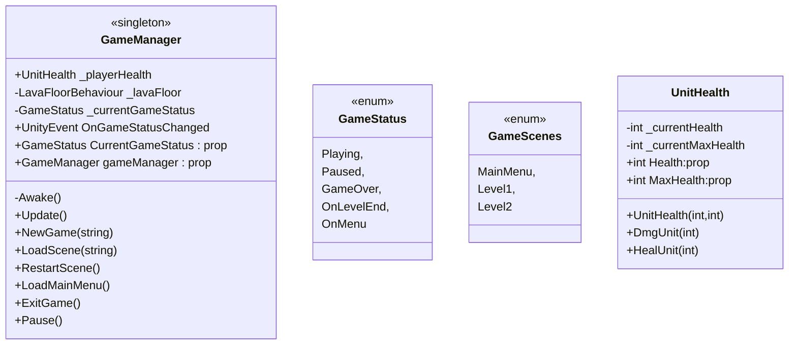
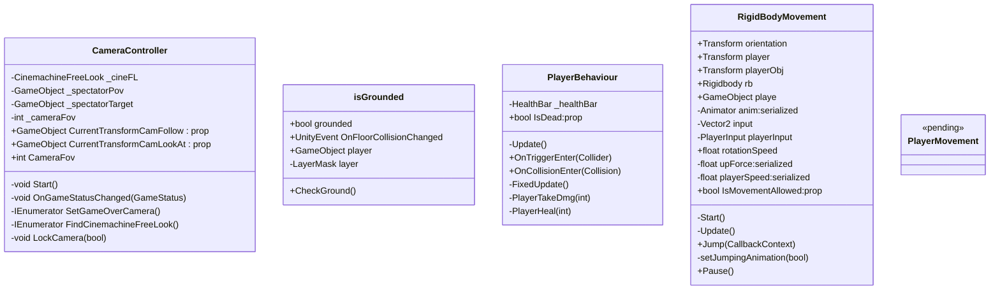
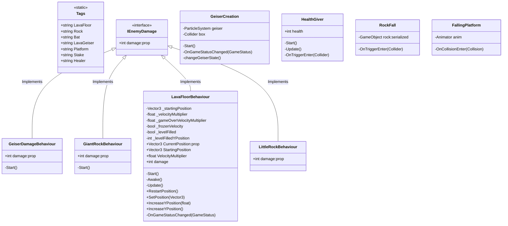
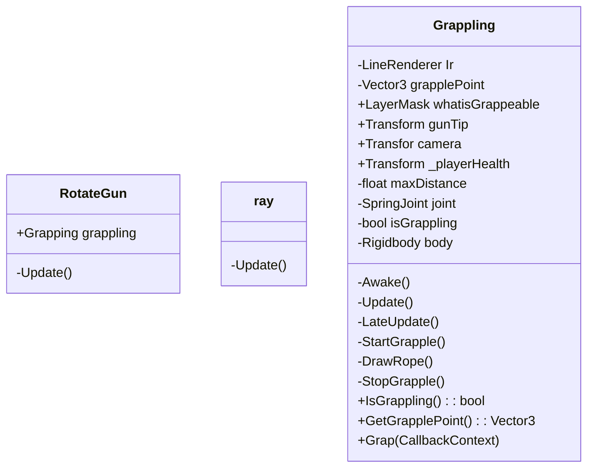
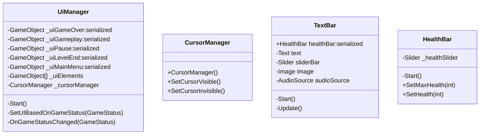

# Floor-is-Lava
A third person game where you have to escape from an erupting volcano

GameManager y control de estados del juego

Gameplay basico (movimiento, camara, colliders)

Daños del entorno

Mecánica de grappling

UI

