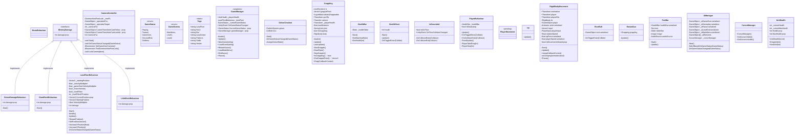

# Floor-is-Lava
A third person game where you have to escape from an erupting volcano

```mermaid

classDiagram

	class MonoBehaviour{
	}

    class IEnemyDamage{
    <<interface>>
    +int damage:prop
    }

    class CameraController{
        -CinemachineFreeLook _cineFL
        -GameObject _spectatorPov
        -GameObject _spectatorTarget
        -int _cameraFov
        +GameObject CurrentTransformCamFollow : prop
        +GameObject CurrentTransformCamLookAt : prop
        +int CameraFov
        -void Start()
        -void OnGameStatusChanged(GameStatus) 
        -IEnumerator SetGameOverCamera()
        -IEnumerator FindCinemachineFreeLook()
        -void LockCamera(bool)
        }

    class GameStatus{
    <<enum>>
    Playing,
    Paused,
    GameOver,
    OnLevelEnd,
    OnMenu

    }

    class GameScenes{
        <<enum>>
        MainMenu,
        Level1,
        Level2
    }

    class Tags{
        <<static>>
        +string LavaFloor
        +string Rock
        +string Bat
        +string LavaGeiser
        +string Platform
        +string Stake
        +string Healer 
    }

    class GameManager{
      <<singleton>>
      +UnitHealth _playerHealth
      -LavaFloorBehaviour _lavaFloor
      -GameStatus _currentGameStatus
      +UnityEvent<GameStatus> OnGameStatusChanged
      +GameStatus CurrentGameStatus : prop
      +GameManager gameManager : prop
      -Awake()
      +Update()
      +NewGame(string)
      +LoadScene(string)
      +RestartScene()
      +LoadMainMenu()
      +ExitGame()
      +Pause()
    }

    class GeiserCreation{
        -ParticleSystem geiser
        -Collider box
        -Start()
        -OnGameStatusChanged(GameStatus)
        -changeGeiserState()
    }

    IEnemyDamage<|--GeiserDamageBehaviour : Implements
    class GeiserDamageBehaviour{
        +int damage:prop
        -Start()
    }

    IEnemyDamage<|--GiantRockBehaviour : Implements
    class GiantRockBehaviour{
        +int damage:prop
        -Start()
    }

    class Grappling{
        -LineRenderer Ir
        -Vector3 grapplePoint
        +LayerMask whatisGrappeable
        +Transform gunTip
        +Transfor camera
        +Transform _playerHealth
        -float maxDistance
        -SpringJoint joint
        -bool isGrappling
        -Rigidbody body
        -Awake()
        -Update()
        -LateUpdate()
        -StartGrapple()
        -DrawRope()
        -StopGrapple()
        +IsGrappling() : bool
        +GetGrapplePoint() : Vector3
        +Grap(CallbackContext)
    }

    class HealthBar{
        -Slider _healthSlider
        -Start()
        +SetMaxHealth(int)
        +SetHealth(int)
    }

    class HealthGiver{
        +int health
        -Start()
        -Update()
        -OnTriggerEnter(Collider)
    }

    class isGrounded{
        +bool isOnFloor
        +UnityEvent<bool> OnFloorCollisionChanged
        -OnCollisionEnter(Collision)
        -OnCollisionExit(Collision)
    }

    IEnemyDamage<|-- LavaFloorBehaviour : Implements
    class LavaFloorBehaviour{
        -Vector3 _startingPosition
        -float _velocityMultiplier
        -float _gameOverVelocityMultiplier
        -bool _frozenVelocity
        -bool _levelFilled
        -int _levelFilledYPosition
        +Vector3 CurrentPosition:prop
        +Vector3 StartingPosition
        +float VelocityMultiplier
        +int damage
        -Start()
        -Awake()
        -Update()
        +RestartPosition()
        +SetPosition(Vector3)
        +IncreaseYPosition(float)
        +IncreaseYPosition()
        -OnGameStatusChanged(GameStatus)
    }

    IEnemyDamage<|-- LittleRockBehaviour : Implements
    class LittleRockBehaviour{
        +int damage:prop
    }

    class PlayerBehaviour{
        -HealthBar _healthBar
        +bool IsDead:prop
        -Update()
        +OnTriggerEnter(Collider)
        +OnCollisionEnter(Collision)
        -FixedUpdate()
        -PlayerTakeDmg(int)
        -PlayerHeal(int)
    }

    class PlayerMovement{
        <<pending>>
    }

    class ray{
        -Update()
    }

    class RigidBodyMovement{
        +Transform orientation
        +Transform player
        +Transform playerObj
        +Rigidbody rb
        +GameObject playe
        -Animator anim:serialized
        -Vector2 input
        -PlayerInput playerInput
        +float rotationSpeed
        -float upForce:serialized
        -float playerSpeed:serialized
        +bool IsMovementAllowed:prop
        -Start()
        -Update()
        +Jump(CallbackContext)
        -setJumpingAnimation(bool)
        +Pause()
    }

    class RockFall{
        -GameObject rock:serialized
        -OnTriggerEnter(Collider)
    }

    class RotateGun{
        +Grapping grappling
        -Update()
    }

    class TextBar{
        +HealthBar healthBar:serialized
        -Text text
        -Slider sliderBar
        -Image image
        -AudioSource audioSource
        -Start()
        -Update()
    }

    class UiManager{
        -GameObject _uiGameOver:serialized
        -GameObject _uiGameplay:serialized
        -GameObject _uiPause:serialized
        -GameObject _uiLevelEnd:serialized
        -GameObject _uiMainMenu:serialized
        -GameObject[] _uiElements
        -CursorManager _cursorManager
        -Start()
        -SetUIBasedOnGameStatus(GameStatus)
        -OnGameStatusChanged(GameStatus)
    }

    class CursorManager{
        +CursorManager()
        +SetCursorVisible()
        +SetCursorInvisible()
    }

    class UnitHealth{
        -int _currentHealth
        -int _currentMaxHealth
        +int Health:prop
        +int MaxHealth:prop
        +UnitHealth(int,int)
        +DmgUnit(int)
        +HealUnit(int)
    }
```
